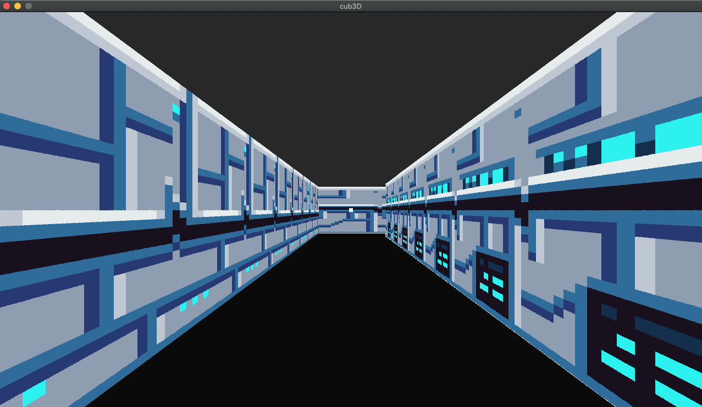

<p align="center">
<a href="https://github.com/jpedr0c/42_cub3d">

</a>
</p>
<h1 align=center>
  <strong> CUB3D </strong>
</h1>

<p align="center">
  <sub> Cub3D is a project that aims to create a "Wolfenstein 3D" style game using the miniLibX graphics library. The game is a first-person 3D maze.
  <sub>
</p>


[](#table-of-contents)

<p align="center">
  <a href="#About"> 💡 About the project </a>&nbsp;&nbsp;&nbsp;|&nbsp;&nbsp;&nbsp;
  <a href="#HowPlay"> 🕹️ How to play</a>&nbsp;&nbsp;&nbsp;|&nbsp;&nbsp;&nbsp;
  <a href="#Controls"> ⌨️ Game controls</a>&nbsp;&nbsp;&nbsp;|&nbsp;&nbsp;&nbsp;
  <a href="#Images"> 📷 Images</a>&nbsp;&nbsp;&nbsp;|&nbsp;&nbsp;&nbsp;
  <a href="#Credits"> 🏆 Credits</a>&nbsp;&nbsp;&nbsp;&nbsp;&nbsp;&nbsp;
</p>

<br/>

<a id="About"></a>
## 💡 About the project
> This project is an introductory 3D graphics project that is part of the curriculum at the 42 programming school. It challenges to write a first-person maze game using the raycasting rendering technique. The player can move through the maze using the WASD keys and rotate the view using the right and left arrow keys. This project was developed using the C programming language and the minilibx (for 3D rendering) graphics libraries.

<br/>

<a id="HowPlay"></a>
## 🕹️ How to play

1. Clone this repository
```sh
git clone https://github.com/jpedr0c/42_cub3d.git
```
2. In the project directory, compile the program using the following command
```sh
make
```
3. Run the game
```sh
./cub3D maps/mine.cub
```
- Where "maps/mine.cub" is the path to the map file that you want to use in the game. You can use any map file provided in the "maps" folder or create your own.
4. If you want to remove the object files generated during compilation
```sh
make clean
```
5. If you want to remove the object files and executable generated during compilation
```sh
make fclean
```

<br/>

<a id="Controls"></a>
## ⌨️ Game controls  
The game is played in first person and the player can move using the following keys:

- `W`: move forward  
- `S`: move backwards  
- `A`: move left  
- `D`: move right  
- `Left/Right Arrows`: rotate the view left/right  
- `ESC`: exit the game 

<br/>

 <a id="Images"></a>
## 📷 Images
Below are screenshots of the three maps included with the Cub3D project. These maps have different sizes and wall configurations.

 ⭐ mine.cub | ⭐ tech.cub |
|---|---|
 | 
 
- To run the game with a specific map, simply replace "maps/mine.cub" in the command to run the game with the name of the desired map file (e.g., "maps/tech.cub").

 <br/>
 
 <a id="Credits"></a>
## 🏆 Credits
<h3 align="center">Thank you for taking the time to review our project!!!</h3>
    
<h4>The members of our team include:</h4>   
<div>
  
| [<br><p align="center"> João Pedro </p>](https://github.com/jpedr0c)[](https://www.github.com/jpedr0c) [](https://www.linkedin.com/in/jpedroc) | [<br><p align="center"> Raoni Silva </p>](https://github.com/raonieqr)[](https://www.github.com/raonieqr) [](https://www.linkedin.com/in/raonieqr/) |
|---|---|
  
</div>
